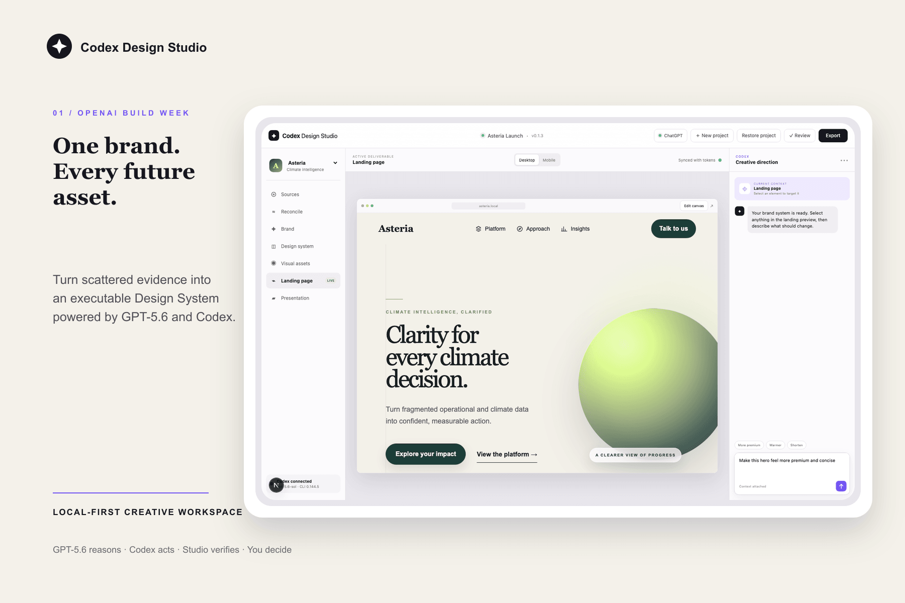

# Codex Design Studio

[](https://github.com/jberdah/codex-design-studio/actions/workflows/ci.yml)
[](LICENSE)

**Turn scattered brand evidence into a living Design System, then let GPT-5.6 and Codex create, edit, verify, and export production assets from it.**

Codex Design Studio is a local-first desktop workspace for founders and small product teams that need brand-consistent Web experiences, presentations, and visual assets without rebuilding the same creative context for every deliverable.

Most AI design tools stop at a plausible screenshot. Codex Design Studio edits the real artifact, renders the result, and keeps the proposed change separate until deterministic checks and the user accept it.



## Judge quick start

The shortest reproducible path is:

```bash
npm install
npm run preflight
npm run dev
```

Open <http://127.0.0.1:3000>, then:

1. Connect a ChatGPT/Codex account from the account control.
2. Create a project from a short brand description and an optional reference URL.
3. Review the synthesized facts, inferences, assumptions, source evidence, and creative brief before approving it.
4. Select an element in the live Web preview and ask for a composition-level change.
5. Compare the candidate against the current artifact and inspect desktop/mobile QA evidence.
6. Accept or reject the candidate, then export HTML, design tokens, or an editable PowerPoint deck.

The deterministic demo path and automated tests do not require a live model call. Live creative editing and image generation use the connected OpenAI account.

## Why GPT-5.6, Codex, and a validating host

The system intentionally separates creative reasoning, agency, verification, and authority.

### GPT-5.6 reasons and creates

The default model, `gpt-5.6-sol`, receives the active BrandSystem, immutable source evidence, the selected visual context, current artifact source, and the user's instruction. It is used to:

- reconcile incomplete or conflicting brand inputs;
- distinguish facts, inferences, and assumptions;
- synthesize structured creative briefs rather than copy raw onboarding text;
- reason across Web, presentation, and visual-asset constraints;
- make composition-level design changes; and
- invoke native OpenAI image capabilities through the connected account.

### Codex acts

Codex App Server provides authenticated agent execution through the user's ChatGPT account or an optional API key. It can inspect the project, invoke project-local skills, edit the actual HTML/CSS/SVG, and keep project threads resumable.

### Codex Design Studio verifies

The desktop host—not the model—owns persistence and acceptance. It snapshots the active artifact, validates source changes, renders Playwright evidence, checks responsive overflow and preview instrumentation, records immutable candidates, and restores the original when execution fails.

### The user decides

Extracted evidence and generated briefs require approval. A candidate blocked by a conservative deterministic check can be compared, explicitly accepted, or rejected; the model cannot silently promote its own work.

> **GPT-5.6 reasons and creates. Codex acts. Codex Design Studio verifies. The user decides.**

## What the current build includes

- ChatGPT and API-key authentication through official Codex App Server account methods;
- native workspace selection with portable, isolated local projects;
- guided project bootstrap from manual direction and optional reference websites;
- editable briefs containing evidence-backed facts, inferences, assumptions, questions, and source intent;
- URL, document, logo, image, and local/remote Git source contracts with provenance and recoverable extraction state;
- immutable BrandSystem versions, conflict reconciliation, presets, and project-owned tokens;
- contextual selection and stable inline text editing inside the live Web preview;
- freeform HTML/CSS/SVG editing beyond token and copy fields;
- transactional Web candidates with before/after renders, explicit review, rollback, and user override;
- an editable slide scene graph with move, resize, keyboard controls, undo/redo, grouping, alignment, z-order, typography, and colour controls;
- versioned OpenAI visual generation, comparison, approval, refinement, restore, and placement;
- responsive HTML ZIP, token JSON, and editable PowerPoint export;
- optional provider-neutral GitHub, GitLab, and Bitbucket integration contracts; and
- an Electron shell containing the standalone Next.js application, Codex CLI, and Playwright runtime.

The catalog also defines contracts for Mobile App, Wireframe, Document, Animation, UI Mockups, CV, 3D object, Research, HTML email, Color + Type pairing, Diagram, and Flier. Catalog presence does not imply that every artifact type has a complete editor or exporter in this submission build.

## Requirements

- Node.js 22 LTS and npm 10+ for development;
- a ChatGPT/Codex login or OpenAI API key for live agent and image operations;
- macOS Intel, macOS Apple Silicon, or Windows x64 for the native release; or
- any platform supported by Node.js and Chromium for source development.

The repository pins Codex CLI `0.144.5`, Playwright `1.55.1`, and Electron `43.1.1`. No global Codex installation is required.

## Development and desktop commands

```bash
# Web development
npm run dev

# Electron shell against the development server
npm run desktop:dev

# Full source verification
npm run check:all

# Electron workspace lifecycle
npm run test:electron

# Build and test the native package for the current architecture
npm run desktop:make -- --arch=x64
npm run test:runtime:packaged
npm run test:electron:packaged
```

GitHub Actions builds and launches separate macOS Intel (`darwin-x64`), macOS Apple Silicon (`darwin-arm64`), and Windows (`win32-x64`) packages. Generated packages are written below `out/` and are never committed.

## Portable project model

On first desktop launch, the user chooses or creates a workspace folder:

```text
<selected folder>/.codex-design-studio-workspace.json
<selected folder>/projects/
```

Project content lives in that folder rather than in the application bundle or Electron `userData`. Moving a workspace preserves its ownership marker and allows it to be relinked through the native picker. Electron stores only private recent-workspace metadata and operating-system grants. See [the portable workspace contract](docs/portable-workspaces.md).

Each project can contain:

```text
brand/                 approved brand data
design-system/         versioned tokens
sources/               evidence graph, immutable blobs, extraction runs
web/                   real editable HTML/CSS/SVG
slides/                editable scene graph
visual-assets/         immutable generated asset versions
reviews/               rendered evidence and decisions
exports/               HTML, JSON, PPTX, and evidence bundles
history/               project versions and recovery state
```

## Transactional creative workflow

For a Web change, the host:

1. snapshots the current source and renders desktop/mobile baselines;
2. asks Codex to edit the project-scoped artifact;
3. verifies that the source changed and retained preview instrumentation;
4. renders the candidate at 1440×1000 and 390×844;
5. evaluates overflow, clipping, assets, contrast, focus order, and landmarks;
6. records the candidate and evidence without overwriting the active artifact when checks fail; and
7. promotes, rejects, or restores only through an explicit transaction.

This makes model output inspectable rather than trusting a textual claim that a design was changed successfully.

## Verification

The current source baseline passes:

- **181 Vitest unit, domain, renderer, and integration checks** on macOS/Linux;
- **10 end-to-end Chromium journeys**;
- **1 Electron workspace lifecycle journey**;
- TypeScript generation and typecheck; and
- the standalone Next.js production build.

Four opt-in or platform-gated tests are skipped by default on macOS/Linux because they require external services, account state, or another operating system. Windows passes 179 applicable checks and skips six. Reproduce the standard evidence with:

```bash
npm run check:all
npm run test:electron
```

See [the detailed verification record](docs/verification.md).

The submission media are generated from the real local interface with `npm run media:devpost`. A credential-free 1920×1080 walkthrough draft can be recorded with `npm run media:demo-video`.

## How this project was built during OpenAI Build Week

I worked as the product owner and final decision-maker. I defined the problem, target user, trust model, local-first boundary, creative direction, and the acceptance criteria for the submission.

Codex and GPT-5.6 helped turn those decisions into a working application by:

- reading and challenging the evolving product requirements;
- inspecting comparable desktop creative-agent architectures without copying proprietary code or prompts;
- proposing the project, evidence, candidate, scene-graph, and release models;
- implementing the Electron, Next.js, React, TypeScript, Playwright, and PowerPoint paths;
- writing and running automated tests;
- reproducing visual failures and correcting them from rendered evidence; and
- maintaining implementation plans and handoffs through Brainclaw while product ideation continued.

Key human decisions included keeping projects portable and local, making repository access optional and provider-neutral, requiring approval before a BrandSystem is published, retaining user agency over QA-blocked candidates, and prioritising real editable artifacts over generated screenshots.

The project existed only as an initial French product brief before Build Week. The application architecture, implementation, desktop runtime, artifact workflows, automated validation, and submission materials were produced during the event.

## Architecture

```text
Electron main process
    ├── sandboxed BrowserWindow ──► Next.js Studio UI
    └── embedded standalone Next.js server
            ├── portable project store
            ├── Codex account and App Server client
            ├── evidence-aware bootstrap
            ├── Web and visual-asset agents
            ├── Playwright rendering and deterministic QA
            └── HTML, JSON, evidence, and PPTX exporters
```

The supplied Claude Desktop archive informed only the high-level decision to isolate UI, agent runtime, and heavyweight workers. No proprietary source code, prompts, skills, or assets are included in this repository or its packages.

See [the architecture](docs/architecture.md), [the demo script](docs/demo-script.md), and [the judge testing instructions](docs/judge-testing.md).

## Project layout

```text
desktop/                  Electron main process and runtime preparation
docs/                     architecture, verification, demo, and workspace contracts
projects/                 inspectable development project workspaces
skills/                   brand and Web art-direction workflows
src/domain/               project, artifact, bootstrap, and integration contracts
src/server/               storage, extraction, Codex, QA, jobs, and exports
src/app/api/              project-scoped HTTP boundary
src/components/           Studio canvas, project UI, account UI, and chat
tests/                    unit, renderer, Chromium, and Electron journeys
```

## Deliberate limits

This submission is local-first and single-user by default. Collaboration and repository providers are opt-in contracts rather than a hosted synchronization service. Signing/notarization, auto-update, cloud collaboration, and some catalog artifact editors remain production work. Live authentication and image generation depend on OpenAI account availability; deterministic tests remain local.

## License

[MIT](LICENSE)
